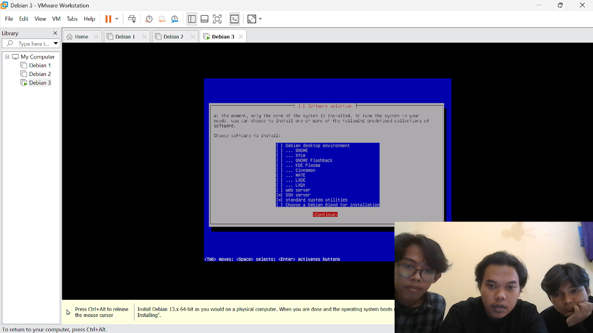
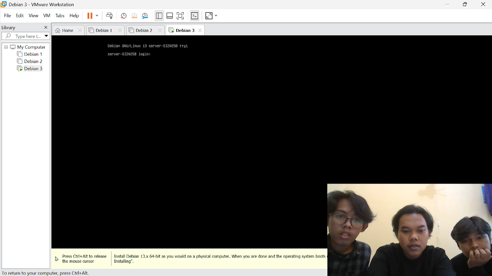
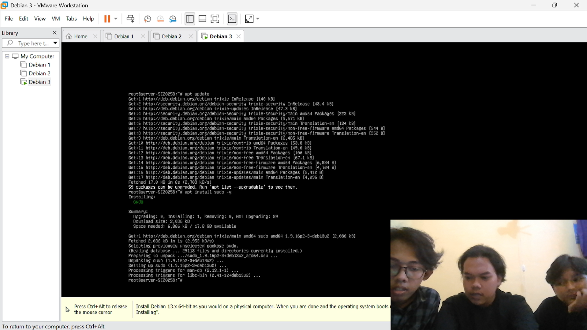
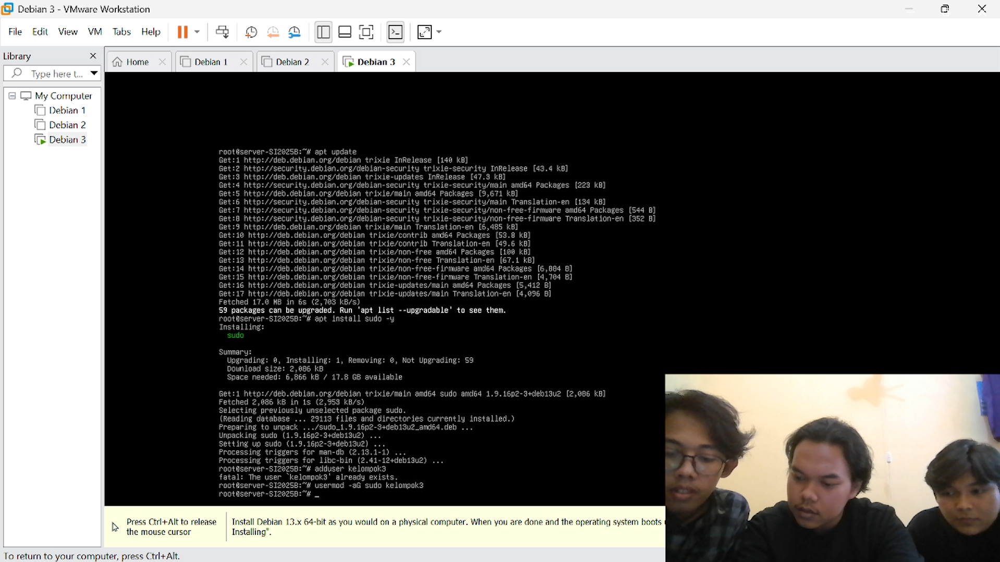
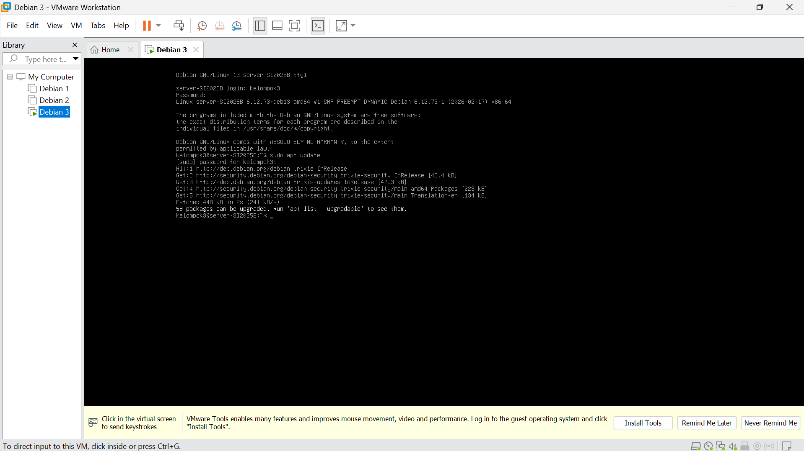
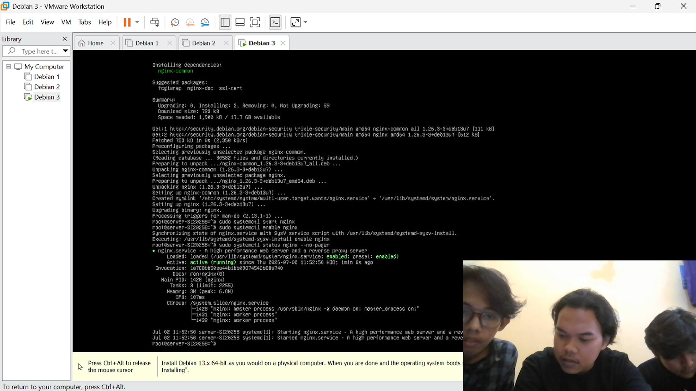
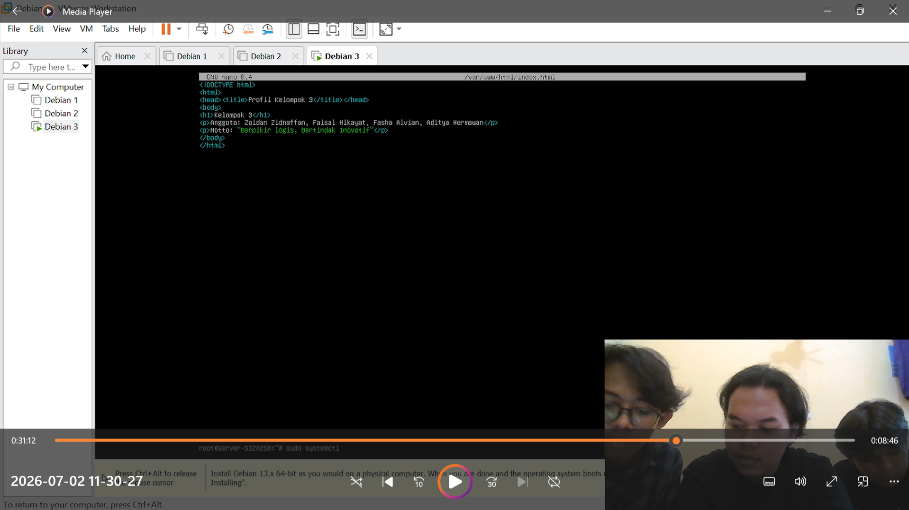
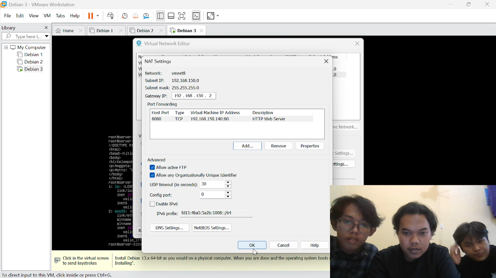
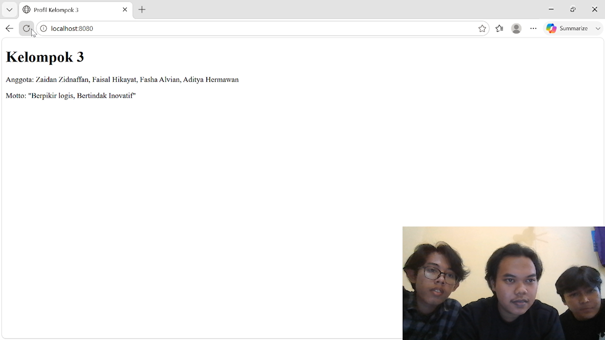

# Laporan Tugas Kelompok
## Instalasi Debian 13 Headless Web Server

**Mata Kuliah:** Sistem Operasi (SI-25)  
**Program Studi:** Sistem Informasi  
**Universitas Galuh**

---

# 👥 Anggota Kelompok 3 (SI-2025B)

1. Zaidan Zidnaffan - 7020250028
2. Faisal Hikayat Padilah – 7020250026
3. Fasha Alvian – 70202500
4. Aditya Hermawan – 70202500


---

# 🎯 Spesifikasi Lingkungan Server

| Komponen | Keterangan |
|----------|------------|
| Hypervisor | VMware Workstation Pro |
| Sistem Operasi | Debian 13 Headless (CLI) |
| Hostname | server-SI2025B |
| IP Address VM | 192.168.150.140 |
| Web Server | Nginx |
| Port Forwarding | Host 8080 → Guest 80 |

IP Address diperoleh menggunakan perintah:

```bash
ip a
```

Kemudian melihat interface **ens33**.

---

# 🛠️ Langkah-Langkah Praktikum

# 1. Instalasi Debian 13 Headless

Pada tahap pertama dilakukan instalasi sistem operasi Debian 13 menggunakan mode teks (CLI) tanpa desktop environment sehingga server menjadi lebih ringan dan efisien.

## Langkah 1. Boot Installer Debian

- Jalankan virtual machine menggunakan file ISO Debian 13.
- Pada menu awal installer pilih **Install** (bukan Graphical Install).

**Penjelasan**

Mode Install digunakan agar proses instalasi berlangsung menggunakan tampilan terminal (headless).

---

## Langkah 2. Memilih Bahasa

Pilih bahasa installer.

Contoh:

- English

Klik **Continue**.

**Penjelasan**

Bahasa installer hanya digunakan selama proses instalasi.

---

## Langkah 3. Memilih Negara

Pilih lokasi sesuai wilayah.

Contoh:

- Indonesia

Klik **Continue**.

**Penjelasan**

Lokasi digunakan untuk menentukan timezone dan mirror repository Debian.

---

## Langkah 4. Layout Keyboard

Pilih keyboard:

- American English

Klik Continue.

---

## Langkah 5. Konfigurasi Jaringan

Installer akan mendeteksi kartu jaringan secara otomatis.

Apabila menggunakan DHCP maka alamat IP akan diperoleh otomatis.

Jika diminta Domain Name dapat dikosongkan.

---

## Langkah 6. Konfigurasi Hostname

Masukkan hostname:

```text
kelompok3
```

Klik Continue.

**Penjelasan**

Hostname merupakan nama komputer yang akan digunakan di dalam jaringan.

---

## Langkah 7. Membuat User

Masukkan:

- Password root
- Nama user
- Username
- Password user

**Penjelasan**

Root digunakan sebagai administrator sedangkan user biasa digunakan untuk aktivitas harian.

---

## Langkah 8. Partisi Harddisk

Pilih menu:

```
Guided - use entire disk
```

Pilih harddisk:

```
/dev/sda
```

Kemudian pilih:

```
All files in one partition (recommended)
```

Lalu pilih:

```
Finish partitioning and write changes to disk
```

Pilih **Yes**.

**Penjelasan**

Metode Guided membuat partisi secara otomatis menggunakan seluruh kapasitas harddisk.

---

## Langkah 9. Instalasi Sistem

Installer mulai menyalin seluruh file sistem Debian ke harddisk.

Tunggu hingga proses selesai.

---

## Langkah 10. Software Selection

Pada menu Software Selection hanya centang:

- SSH Server
- Standard System Utilities

Hilangkan centang lainnya.

**Penjelasan**

SSH Server digunakan untuk mengakses server dari komputer lain.

Standard System Utilities merupakan utilitas dasar yang dibutuhkan sistem.

Tidak menginstal Desktop Environment agar server tetap ringan.

### Screenshot Software Selection



---

## Langkah 11. Instalasi GRUB

Saat muncul pertanyaan:

Install the GRUB boot loader?

Pilih:

```
Yes
```

Kemudian pilih lokasi:

```
/dev/sda
```

**Penjelasan**

GRUB merupakan bootloader yang digunakan untuk menjalankan sistem operasi ketika komputer dinyalakan.

---

## Langkah 12. Login Pertama

Setelah restart, login menggunakan user yang telah dibuat.

### Screenshot Login Debian



---

# 2. Konfigurasi User Sudo dan Update Repository

Setelah instalasi selesai dilakukan konfigurasi hak akses administrator pada user biasa.

Masuk sebagai root kemudian jalankan:

```bash
apt update && apt upgrade -y
```

**Penjelasan**

Perintah ini memperbarui daftar repository dan menginstal seluruh paket terbaru sehingga sistem menjadi lebih aman dan stabil.

Selanjutnya install sudo:

```bash
apt install sudo -y
```

Tambahkan user ke grup sudo.

```bash
usermod -aG sudo kelompok3
```

Restart sistem.

```bash
reboot
```

Setelah login kembali, uji menggunakan:

```bash
sudo apt update
```

Apabila meminta password dan berhasil dijalankan berarti konfigurasi sudo berhasil.

### Screenshot







---

# 3. Instalasi Web Server Nginx

Install seluruh paket yang dibutuhkan.

```bash
sudo apt install net-tools curl git nginx -y
```

Keterangan:

- net-tools digunakan untuk melihat konfigurasi jaringan.
- curl digunakan untuk melakukan request HTTP.
- git digunakan untuk clone repository.
- nginx digunakan sebagai web server.

Jalankan service.

```bash
sudo systemctl start nginx
```

Agar otomatis aktif saat boot.

```bash
sudo systemctl enable nginx
```

Periksa status service.

```bash
sudo systemctl status nginx
```

Status harus menunjukkan:

```
active (running)
```

### Screenshot



---

# 4. Membuat Halaman Profil Kelompok

Masuk ke direktori web.

```bash
cd /var/www/html
```

Edit file bawaan.

```bash
sudo nano index.html
```

Masukkan halaman HTML berisi identitas kelompok.

Simpan perubahan.

Restart nginx.

```bash
sudo systemctl restart nginx
```

**Penjelasan**

Restart dilakukan agar konfigurasi dan halaman web terbaru dimuat kembali oleh Nginx.

### Screenshot



---

# 5. Konfigurasi Port Forwarding VMware

Buka:

```
Edit
→ Virtual Network Editor
→ NAT Settings
```

Tambahkan aturan:

| Host Port | Guest Port |
|------------|------------|
| 8080 | 80 |

Simpan konfigurasi.

Buka browser Windows Host.

Akses:

```
http://localhost:8080
```

Apabila halaman profil kelompok muncul berarti konfigurasi berhasil.

### Screenshot NAT



### Screenshot Browser



---

# 🎥 Link Video Demo

Tambahkan tautan video YouTube atau Google Drive di bawah ini.

```
https 
```

---

# 📝 Kesimpulan

Berdasarkan praktikum yang telah dilakukan, kelompok kami berhasil menyelesaikan proses instalasi Debian 13 Headless dari tahap pemasangan sistem operasi, konfigurasi pengguna, hingga manajemen hak akses. Melalui praktikum ini diperoleh pemahaman bahwa server berbasis Command Line Interface (CLI) jauh lebih ringan dibandingkan server yang menggunakan Graphical User Interface (GUI), sehingga sangat efisien dalam penggunaan sumber daya komputer. Selain itu, kami juga berhasil mengonfigurasi repositori sistem untuk memperbarui paket menggunakan perintah apt update, memasang utilitas esensial seperti sudo untuk keamanan administrasi, serta memastikan layanan SSH aktif agar server dapat dikendalikan dengan mudah dari komputer lain melalui jaringan.

## Poin-poin yang Dipelajari

- Memahami proses instalasi Debian 13 dalam mode headless tanpa GUI.
- Memahami konfigurasi pengguna (user) dan pemisahan hak akses administratif.
- Memahami cara memperbarui daftar paket repositori menggunakan perintah apt update.
- Memahami instalasi, konfigurasi, dan pengelolaan layanan SSH Server menggunakan systemctl.
- Menambahkan pengalaman baru dalam melakukan administrasi server Linux berbasis terminal.
